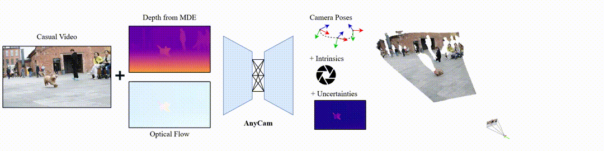

# AnyCam: Learning to Recover Camera Poses and Intrinsics from Casual Videos



[**Project Page**](https://fwmb.github.io/anycam) | [**ArXiV**](https://arxiv.org/abs/2503.23282)

This is the official implementation for the CVPR 2025 paper:

> **AnyCam: Learning to Recover Camera Poses and Intrinsics from Casual Videos**
>
> [Felix Wimbauer](https://fwmb.github.io/)<sup>1,2,3</sup>, [Weirong Chen](https://wrchen530.github.io/)<sup>1,2,3</sup>, [Dominik Muhle](https://dominikmuhle.github.io/)<sup>1,2</sup>, [Christian Rupprecht](https://chrirupp.github.io/)<sup>3</sup>, and [Daniel Cremers](https://cvg.cit.tum.de/members/cremers)<sup>1,2</sup><br>
> <sup>1</sup>Technical University of Munich, <sup>2</sup>MCML, <sup>3</sup>University of Oxford
> 
> [**CVPR 2025** (arXiv)](https://arxiv.org/abs/2503.23282)

If you find our work useful, please consider citing our paper:
```
@inproceedings{wimbauer2025anycam,
  title={AnyCam: Learning to Recover Camera Poses and Intrinsics from Casual Videos},
  author={Wimbauer, Felix and Chen, Weirong and Muhle, Dominik and Rupprecht, Christian and Cremers, Daniel},
  booktitle = {Proceedings of the IEEE/CVF Conference on Computer Vision and Pattern Recognition},
  year={2025}
}
```

**<span style="color:red;">WARNING: This is a preliminary code release with no guarantees. The repository is still Work in Progress (WiP) and a lot of cleaning-up and documenting will happen in the future.</span>**

## News

**2025/04** Improved demo script and colmap export.

**2025/04** Initial code release.

## Setting Up the Environment

To set up the environment, follow these steps individually or see below:

1. Create a new conda environment with Python 3.11:
    ```sh
    conda create -n anycam python=3.11
    ```

2. Activate the conda environment:
    ```sh
    conda activate anycam
    ```

3. Install pytorch according to your CUDA version:
    ```sh
    pip install torch==2.5.1 torchvision==0.20.1 torchaudio==2.5.1 --index-url https://download.pytorch.org/whl/cu124
    ```

4. Install the corresponding cudatoolkit for compilation:
    ```sh
    conda install -c nvidia cuda-toolkit
    ```

5. Install the required packages from `requirements.txt`:
    ```sh
    pip install -r requirements.txt
    ```
    

Combined, this yields the following comand. Building might take a few minutes.
```sh
conda create -n anycam python=3.11 -y && \
conda activate anycam && \
pip install torch==2.5.1 torchvision==0.20.1 torchaudio==2.5.1 --index-url https://download.pytorch.org/whl/cu124 && \
conda install -c nvidia cuda-toolkit -y && \
pip install -r requirements.txt
```

## Note on dependencies

We use a slightly customized fork of UniMatch and UniDepth (in order to ensure backward-compatibility).
Furthermore, we use the minipytorch3d variant by VGGSfM.

## Download pretrained checkpoint

To download pretrained models, you can use the `download_checkpoints.sh` script. Follow these steps:

1. Open a terminal and navigate to the root directory of the repository.

2. Run the `download_checkpoints.sh` script with the desired model name. For example, to download the final `anycam_seq8` model, use the following command:
    ```sh
    ./download_checkpoints.sh anycam_seq8
    ```

This will download and unpack the pretrained model into the `pretrained_models` directory. You can then use the downloaded model for evaluation or further training.

## Demo

You can use the demo script to process custom videos and extract camera trajectories, depth maps, and 3D point clouds.

### Basic Usage

We provide a simple script to run the basic functionality of AnyCam and export the results. The results can either be visualized in rerun.io, or exported to the Colmap format. 
To run the model in feed-forward only mode, turn off the ``ba_refinement`` flag.
If the provided video has a high framerate, we recommend to subsample the video to a lower framerate by adding the ``fps=10`` flag.

```sh
# Full model
python anycam/scripts/anycam_demo.py \
    input_path=/path/to/video.mp4 \ 
    model_path=pretrained_models/anycam_seq8 \
    visualize=true

# Feed-foward only without refinement
python anycam/scripts/anycam_demo.py \
    input_path=/path/to/video.mp4 \
    model_path=pretrained_models/anycam_seq8 \
    ba_refinement=false \
    visualize=true
```

### Visualization with Remote Setup

If you are developing on a remote server, you can start rerun.io as a webserver. First, open a new terminal on your remote machine and start the viewer:
```sh
rerun --serve-web
```
Then, forward port 9090 to your local machine. Finally, make sure to launch the script with the ``++rerun_mode=connect``.
You should be able to view the results in your browser under:
```
http://localhost:9090/?url=ws://localhost:9877
```

### Export Options

Export to COLMAP format:

```sh
python anycam/scripts/anycam_demo.py \
    input_path=/path/to/video.mp4 \
    model_path=pretrained_models/anycam_seq8 \
    export_colmap=true \
    output_path=/path/to/output_dir
```

Save trajectory, depth maps, and other results:

```sh
python anycam/scripts/anycam_demo.py \
    input_path=/path/to/video.mp4 \
    model_path=pretrained_models/anycam_seq8 \
    output_path=/path/to/output_dir
```

## Evaluation

To evaluate the AnyCam model, run the following command:
```sh
python anycam/scripts/evaluate_trajectories.py -cn evaluate_trajectories ++model_path=pretrained_models/anycam_seq8
```

You can also enable the `with_rerun` option during evaluation to plot the process to rerun.io:
```sh
python anycam/scripts/evaluate_trajectories.py -cn evaluate_trajectories ++model_path=pretrained_models/anycam_seq8 ++fit_video.ba_refinement.with_rerun=true
```

## Visualization

You can use the Jupyter notebook `anycam/scripts/anycam_4d_plot.ipynb` for visualizing the results.

For more details, refer to the individual scripts and configuration files in the repository.

## Training

### Data Preparation

We use five datasets to train AnyCam:

1. [RealEstate10K](https://google.github.io/realestate10k/)
2. [YouTube VOS](https://youtube-vos.org/)
3. [WalkingTours](https://huggingface.co/datasets/shawshankvkt/Walking_Tours)
4. [OpenDV](https://huggingface.co/datasets/shawshankvkt/Walking_Tours)
5. [EpicKitchens](https://epic-kitchens.github.io/2025)

We will soon release instructions on how to setup the data.

### Training Stages

To train the AnyCam model, run the following commands. The provided setup assumes two A100 40GB GPUs. If your setup is different, modify the ``++nproc_per_node`` and ``++backend`` flags.

**First stage** (2 frames):
```sh
python train_anycam.py -cn anycam_training  \
    ++nproc_per_node=2 \
    ++backend=nccl \
    ++name=anycam_seq2 \
    ++output.unique_id=baseline
```

**Second stage** (8 frames):
```sh
python train_campred.py -cn anycam_training \
    ++nproc_per_node=2 \
    ++backend=nccl \
    ++name=anycam_seq8 \
    ++output.unique_id=baseline \
    ++batch_size=4 \
    ++dataset_params.frame_count=8 \
    ++training.optimizer.args.lr=1e-5 \
    ++training.from_pretrained=out/anycam_training/anycam_seq2_backend-nccl-2_baseline/training_checkpoint_247500.pt \
    ~dataloading.staged_datasets \
    ++validation.validation.fit_video_config=cam_pred/configs/eval_cfgs/train_eval.yaml \
    ++loss.0.lambda_label_scale=100
```
